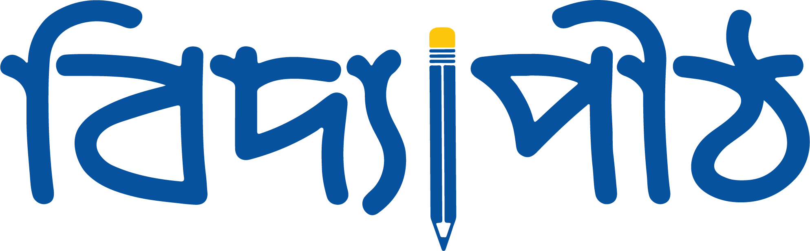
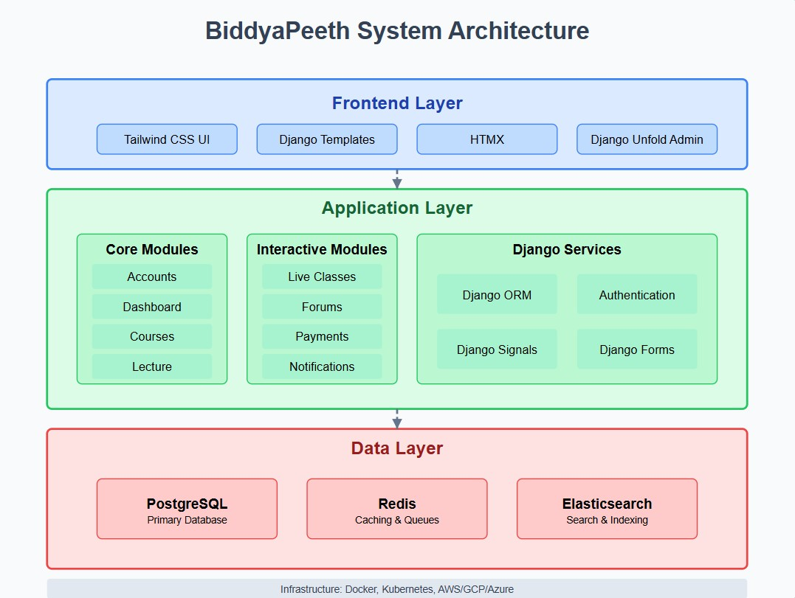
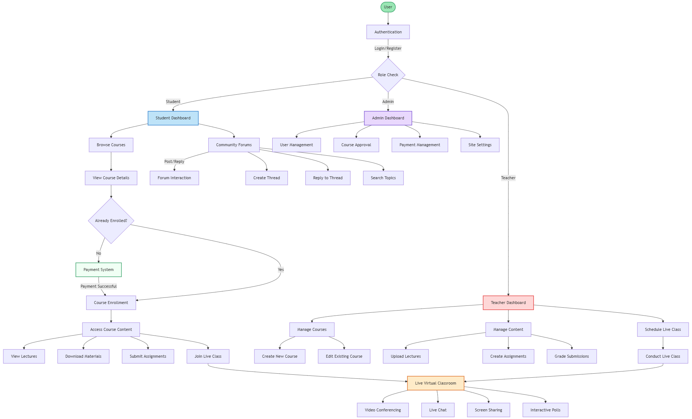
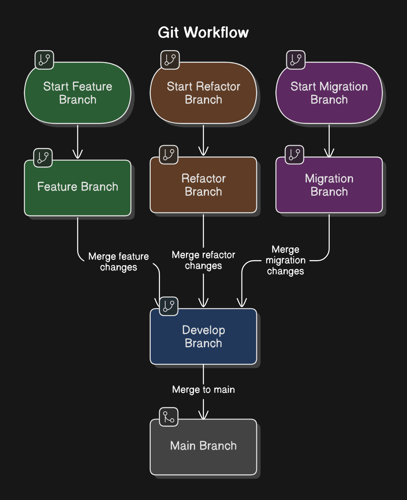

<div align="center">



<h3>Empowering Learning, Anywhere, Anytime</h3>
<h4> From foundational knowledge to advanced mastery, BiddyaPeeth helps you learn, grow, and succeed at your own pace.<h4>

### Tech Stack

<p align="center">
  <a href="https://www.djangoproject.com/">
    
  </a>
  <a href="https://www.postgresql.org/">
    
  </a>
  <a href="https://www.docker.com/">
    
  </a>
  <a href="https://redis.io/">
    
  </a>
  <a href="https://www.elastic.co/elasticsearch/">
    
  </a>
  <a href="https://tailwindcss.com/">
    
  </a>
  <a href="https://django-unfold.readthedocs.io/">
    
  </a>
  <a href="https://github.com/jazzband/django-silk">
    
  </a>
  <a href="https://www.python.org">
    
  </a>
  <a href="https://github.com/pre-commit/pre-commit">
    
  </a>
  <a href="https://github.com/psf/black">
    
  </a>
  <a href="https://opensource.org/licenses/MIT">
    
  </a>
</p>
</div>


<div align="center">

### SonarCloud Analysis

[](https://sonarcloud.io/summary/new_code?id=Learnathon-By-Geeky-Solutions_mindjunkies)
[](https://sonarcloud.io/summary/new_code?id=Learnathon-By-Geeky-Solutions_mindjunkies)
[](https://sonarcloud.io/summary/new_code?id=Learnathon-By-Geeky-Solutions_mindjunkies)
[](https://sonarcloud.io/summary/new_code?id=Learnathon-By-Geeky-Solutions_mindjunkies)
[](https://sonarcloud.io/summary/new_code?id=Learnathon-By-Geeky-Solutions_mindjunkies)
[](https://sonarcloud.io/summary/new_code?id=Learnathon-By-Geeky-Solutions_mindjunkies)


</div>

<div align="center">
  <a href="https://github.com/Learnathon-By-Geeky-Solutions/mindjunkies/wiki">
    
  </a>
  <a href="https://github.com/Learnathon-By-Geeky-Solutions/mindjunkies/blob/main/docs/guides/getting-started.md">
    
  </a>
  <a href="https://github.com/Learnathon-By-Geeky-Solutions/mindjunkies/blob/main/docs/CONTRIBUTING.md">
    
  </a>
<a href="https://github.com/Learnathon-By-Geeky-Solutions/mindjunkies/tree/main/docs/DevLog">
      <a href="https://github.com/Learnathon-By-Geeky-Solutions/mindjunkies/tree/main/docs/DevLog">
    
  </a>
</div>

---

## 📚 Explore Project Resources

Stay updated and dive deeper into the project!

- 📖 [**Wiki Page**](https://github.com/Learnathon-By-Geeky-Solutions/mindjunkies/wiki) – Project overview,
  documentation, and important guides.
- 🛠️ [**Development Setup**](docs/guides/getting-started.md) – Get started with setting up your development environment.
- 🤝 [**Contributing Guidelines**](docs/CONTRIBUTING.md) – Learn how to contribute and collaborate with us.
- 📄 [**Docs**](docs/README.md) – Comprehensive documentation for developers and users.
- 📓 [**Dev Log**](docs/dev-log.md) – Track our development journey and major updates.

---

## 📋 Table of Contents

- [Project Overview](#-about-biddyapeeth)
- [Live Demo](#-live-demo)
- [Team](#-team-mindjunkies)
- [Key Features](#-key-highlights)
- [System Architecture](#-system-architecture)
- [Database Design](#database-design)
- [Tech Stack](#tech-stack)
- [Getting Started](#getting-started)
- [Development Guidelines](#-development-guidelines)
- [Testing](#-testing)
- [CI Integration](#-ci-integration)
- [Contributing](#-contributing)
- [Git Workflow](#-git-workflow)
- [License](#license)

---

## 🔎 About BiddyaPeeth

**BiddyaPeeth** is an advanced, next-generation **EdTech platform** built with **Django** and **Tailwind CSS**, designed
to revolutionize digital learning experiences.

It offers a **modern, scalable**, and **student-centric** environment for online education, empowering both learners and
instructors with seamless tools for engagement and management.

### 🚀 Key Highlights

- **Role-based dashboards** tailored for students, teachers, and administrators.
- **Comprehensive course management** — from course creation to enrollment and content delivery.
- **Live virtual classrooms** with real-time video conferencing, chat, polls, and screen sharing.
- **Integrated payment solutions** enabling access to premium educational services.
- **Dynamic community forums** for collaborative learning and peer interactions.
- **Scalable and device-friendly** design for accessibility across devices.

---

### 🔥 Why BiddyaPeeth?

Traditional education platforms often suffer from:

- ❌ Poor user experience.
- ❌ Limited real-time interaction capabilities.
- ❌ Lack of modern design and scalability.

**BiddyaPeeth solves these challenges** by offering:

- Seamless course and user management.
- A modern Tailwind CSS frontend.
- Fast deployment with Docker and Kubernetes-ready architecture.
- Real-time communication tools to foster active learning environments.

### 🌍 Market Opportunity

- The global EdTech market is projected to reach **$404 billion** by 2025.
- Increasing demand for **virtual education** and **interactive learning tools** worldwide.

---

## 🌐 Live Demo

Experience Biddyapeeth in action by visiting our live demo:

[](http://biddyapeeth.mindjunkies.tech/)

Explore the platform's features and see how it transforms real-time learning into an interactive, seamless experience.


<div align="center">

## 🖌️ Team MindJunkies

<table style="width: 90%;">
<tr>
<td align="center" width="25%">
<h4>Shafayetul Huda Sadi</h4>

<br><a href="https://github.com/Shafayetsadi"></a>
</td>
<td align="center" width="25%">
<h4>Md. Tonmoy Hossain Jifat</h4>

<br><a href="https://github.com/md-tonmoy007"></a>
</td>
<td align="center" width="25%">
<h4>Farhana Islam Saima</h4>

<br><a href="https://github.com/SaimaLearnathon"></a>
</td>
<td align="center" width="25%">
<h4>Md. Redwanuzzaman</h4>

<br><a href="https://github.com/redwanuzzaman"></a>
</td>
</tr>
</table>

</div>

---

## 🏗 System Architecture

### Architecture Diagram



### 📌 Modules Overview

| Module       | Purpose                                  |
|--------------|------------------------------------------|
| Accounts     | User Authentication and Profile          |
| Courses      | Course Creation, Enrollment              |
| Dashboard    | Role-Based Dashboards (Student, Teacher) |
| Forums       | Community Discussions                    |
| Lecture      | Lecture and Assignment Management        |
| Live Classes | Live Video Integration                   |
| Payments     | Payment and Billing                      |

### System Flow Diagram



#### Operational Flow Explained

1. **Authentication** 🔑
    - User logs in or registers.
    - Role check (Student / Teacher / Admin).

2. **Student Flow** 🎓
    - Browse and view courses.
    - If not enrolled ➔ Payment ➔ Enrollment.
    - Access course content (Lectures, Materials, Assignments, Live Classes).
    - Participate in community forums (Post, Reply).

3. **Teacher Flow** 👩‍🏫
    - Manage content (Create/Edit Courses, Upload Lectures, Create Assignments).
    - Schedule and conduct live classes.
    - Grade student submissions.
    - Use live virtual classroom (Video, Chat, Screen Share, Polls).

4. **Admin Flow** 🛠️
    - Manage users, approve courses, handle payments, and adjust site settings.
    - Moderate forum activity.

5. **Live Interaction & Assessment** 📡
    - Real-time classes and course completion.

### 📂 Project Structure

```bash
mindjunkies/
├── accounts/
├── courses/
├── dashboard/
├── forums/
├── home/
├── lecture/
├── live_classes/
├── payments/
├── static/
├── templates/
project/
├── settings/
|    ├── base.py
|    ├── development.py
|    ├── production.py
├── logging.py
└── urls.py
config/  # JWT and Tokens
k8s/     # Kubernetes Deployment Files
docs/    # Documentation
Dockerfile
manage.py
.. # Other files
```

----------

## Database Design


---

## Getting Started

Follow these steps to set up the project locally:

### Prerequisites

- Python 3.11+
- uv
- PostgreSQL / SQLite

### Local Development Setup

1. Clone the repository:
    ```sh
    git clone https://github.com/Learnathon-By-Geeky-Solutions/mindjunkies
    cd mindjunkies
    ```
2. Install dependencies:
    ```sh
    pip install uv
    uv sync
    ```
3. Start development:
    ```sh
    cp .env.example .env # Modify the environment variables
    python manage.py migrate
    python manage.py createsuperuser
    python manage.py runserver
    python manage.py tailwind watch
    ```
4. Open [http://localhost:8000](http://localhost:8000) in your browser.

### Using Docker

```bash
# Build and start containers
docker-compose up --build
```

----------

## 🛠️ Development Guidelines

To maintain consistency and quality across the codebase, we follow these development best practices:

### 🔹 Code Style
- Follow **PEP8** standards.
- Use **Black** for code formatting:
  ```bash
  black .
  ```
- Use **Pre-commit hooks**:
  ```bash
  pre-commit install
  pre-commit run --all-files
  ```

### 🔹 Linting & Quality
- Use `flake8`, `isort`, and `black` as part of your local pre-commit workflow.
- Monitor **code quality via SonarCloud** for:
  - Maintainability
  - Code smells
  - Security vulnerabilities

### 🔹 Git Workflow
- Use feature branches: `feature/your-feature-name`
- Follow conventional commit messages:  
  e.g., `feat: add live class scheduling UI`
- Always submit Pull Requests (PRs) with:
  - Clear descriptions
  - Screenshots (if UI-related)
  - Linked issues (if applicable)




---

## 🧪 Testing

Testing is critical for ensuring stability and quality across deployments.

### 🔸 Tools Used
- **pytest** for unit testing
- **coverage** for tracking test coverage
- **Model-Bakery** for creating test data

### 🔸 Running Tests
```bash
uv run pytest
```

### 🔸 Checking Coverage
```bash
uv run coverage run -m pytest
uv run coverage report -m
```

### 🔸 CI Integration
- All tests are run automatically on each push via GitHub Actions.
- **SonarCloud** also performs static analysis for test coverage and reliability metrics.
- **Kubernetes** deployment is triggered after successful tests.

---

Let me know if you'd like these turned into markdown or `.md` files for your `docs/` directory.

----------

## 🤝 Contributing

We welcome contributions!  
Please read our [CONTRIBUTING.md](docs/CONTRIBUTING.md) for more information on how to get started.

----------

## License

This project is licensed under the MIT License - see the [LICENSE](LICENSE) file for details.
